# PPS-Unidad3Actividad9-RFI
Explotación y Mitigación de Remote File Inclusion (RFI)

Tenemos como objetivo:

- Ver cómo se pueden hacer ataques Inclusión de Archivos Remotosn (RFI).

- Analizar el código de la aplicación que permite ataques de Inclusión de Archivos Remotosn (RFI).

- Implementar diferentes modificaciones del codigo para aplicar mitigaciones o soluciones.

## ¿Qué es Remote File Inclusion?
---

Remote File Inclusion (Inclusión Remota de Archivos), conocida como RFI, es una vulnerabilidad de seguridad web sobre Inclusión de archivos que permite a un atacante incluir archivos externos (remotos) en una apliación, generalmente explotando un mecanismo “dynamic file inclusion” implementado en la aplicación de destino. La vulnerabilidad se produce debido al uso de la entrada suministrada por el usuario sin la validación adecuada.

Dependiendo de cómo se explite, las consecuencias puede ser: 

- Ejecución remota de código (RCE) en el servidor web.

- Ejecución de scripts maliciosos del lado del cliente, como JavaScript, lo que podría facilitar ataques de Cross-Site Scripting (XSS).

- Denegación de servicio (DoS) mediante la inclusión de archivos grandes o en bucle.

- Divulgación de información sensible, como credenciales o configuraciones internas.

Aunque es más común en aplicaciones escritas en PHP, también puede afectar a otras tecnologías como JSP, ASP, Python, Ruby, etc., siempre que se usen mecanismos de inclusión de archivos sin validar adecuadamente la fuente.

## ACTIVIDADES
---
* Leer detenidamente la sección de vulnerabilidades de subida de archivos.  de la página de PortWigger <https://portswigger.net/web-security/file-upload>

* Lee el siguiente [documento sobre Explotación y Mitigación de ataques de Remote Code Execution](./files/ExplotacionYMitigacionRFI.pdf)

* También y como marco de referencia, tienes [ la sección de correspondiente de ataque de inclusión de archivos remotos de la **Proyecto Web Security Testing Guide** (WSTG) del proyecto **OWASP**.](https://owasp.org/www-project-web-security-testing-guide/v42/4-Web_Application_Security_Testing/07-Input_Validation_Testing/11.2-Testing_for_Remote_File_Inclusion)

### Configuración para deshabilitar la seguridad en PHP 8.2 (sólo para pruebas)

Para poder realizar la actividad vamos a deshabilitar la seguridad y así poder trabajar la vulnerabilidad correctamente. Lo realizaremos cambiando la configuración de PHP.

Para ello nos conectamos a nuestro contenedor si estás utilizando es escenario con docker:

~~~
docker exec -it lamp-php83 /bin/bash
~~~

Una vez conectado, vamos a hacer una copia de seguridad del archivo de configuración para realizar pruebas y al final volver a restaurar.

~~~
cd /usr/local/etc/php/
cp php.ini php.ini-original
nano php.ini
~~~

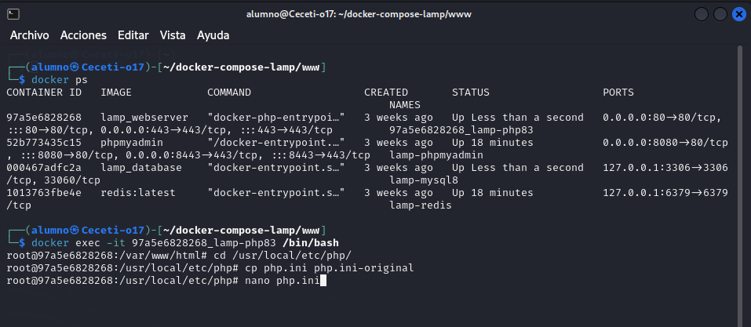

Añadimos al final las variables indicadas:

~~~
disable_functions =
allow_url_include = On
allow_url_fopen = On
open_basedir = 
~~~

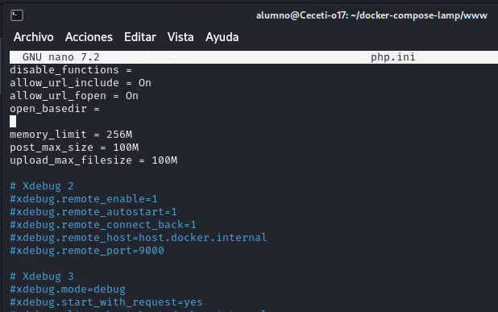

Una vez cambiada la configuración, reiniciamos el servicio o en el caso de que utilicemos docker, reiniciamos el contenedor:

~~~
docker-compose restart webserver
~~~

Aquí puedes encontrar el fichero de configuración [php.ini](files/php.ini.rfi).

El fichero debe tener las siguientes configuraciones:
¿Qué hacemos con estas configuraciones?

1. Elimina todas las funciones deshabilitadas (disable_functions vacío).

2. Habilita la inclusión de archivos remotos (allow_url_include = On).

3. Habilita file_get_contents() para URLs externas (allow_url_fopen = On).

4. Desactiva open_basedir para permitir la ejecución en cualquier directorio.

## Código vulnerable
---

Tenemos el siguiente código vulnerable al cual le tenemos que indicar un fichero a subir al servidor:
~~~
?php
// Verificar si se ha pasado un archivo por parámetro
if (isset($_GET['file'])) {
        $file = $_GET['file'];
        include($file);
}

?>
<form method="GET">
        <input type="text" name="file" placeholder="Usuario">
        <button type="submit">Subir Archivo</button>
</form>

~~~ 

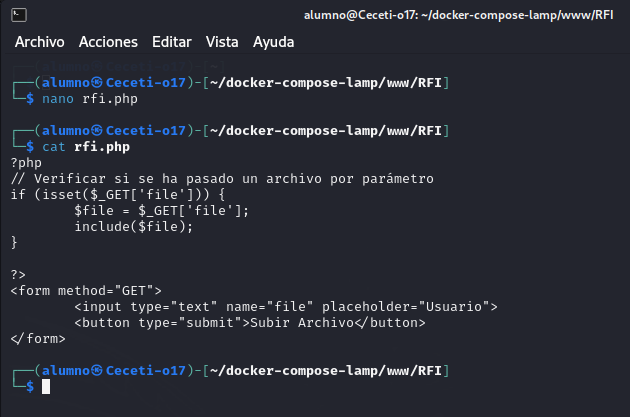

### Explotación de RFI
---
Para comprobar la explotación de RFI vamos a crear un archivo malicioso exploit.php en un servidor controlado por el atacante.

En nuestro caso [exploit.php](files/exploit.php) lo vamos a colocar en nuestro servidor. Tendrá el siguiente contenido:

~~~
<?php
echo "¡Servidor comprometido!";
// Código malicioso, como una web shell o un backdoor
?>
~~~

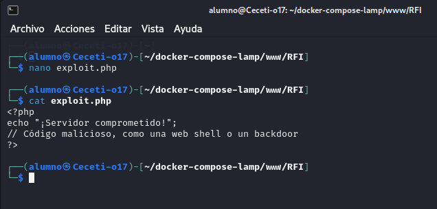

En esta ocasión sólo nos mostrará un mensaje, pero podría hacer muchas cosas más.

Para ejecutarlo a través de la aplicación vulnerable colocando su dirección en nuestro campo

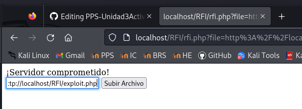

o bien concatenamos su dirección a la de nuestro archivo rfi.php:

~~~
http://localhost/rfi.php?file=http://localhost/exploit.php
~~~

Si el código del atacante se ejecuta en el servidor víctima, significa que la aplicación es vulnerable.

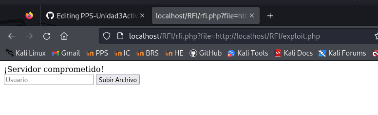

**Posibles efectos del ataque:**

- Acceso no autorizado al servidor.

- Robo de datos sensibles.

- Modificación o eliminación de archivos del sistema.

- Instalación de malware o puertas traseras (backdoors).

## Mitigación de RFI
---

La solución más efectiva para eliminar las vulnerabilidades de inclusión de archivos es evitar pasar la entrada enviada por el usuario a cualquier API de sistema de archivos/marco. Si esto no es posible, la aplicación puede mantener una lista de permisos de archivos que puede incluir la página y, a continuación, utilizar un identificador (por ejemplo, el número de índice) para acceder al archivo seleccionado. Cualquier solicitud que contenga un identificador no válido debe rechazarse para que no haya oportunidad de que los usuarios maliciosos manipulen la ruta. Mira el [Archivo de Hoja de Trucos para buenas prácticas de seguridad](https://cheatsheetseries.owasp.org/cheatsheets/File_Upload_Cheat_Sheet.html) en este tema.

Vamos realizando operaciones.

**Bloquear la inclusión de URLs externas**

En lugar de permitir cualquier entrada sin validación, se debe bloquear la inclusión de archivos remotos:

~~~
<?php
// Verificar si se ha pasado un archivo por parámetro
if (isset($_GET['file'])) {
        $file = $_GET['file'];
        // Bloquear URLs externas
        if (filter_var($file, FILTER_VALIDATE_URL)) {
                die("Incluir archivos remotos está prohibido.");
        }
        // Incluir el archivo sin más restricciones (Aún vulnerable a LFI)
        include($file);
}

?>
<form method="GET">
        <input type="text" name="file" placeholder="Usuario">
        <button type="submit">Iniciar Sesión</button>
</form>
~~~

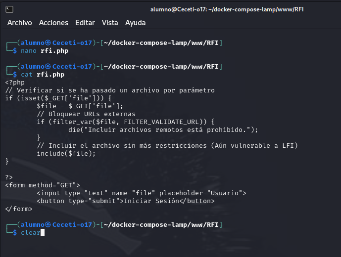

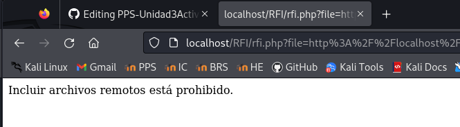

Como se puede observar en la anterior imagen, no permite introducir direcciones url, ya que en el código hemos aplicado un filtro de validación de URLs.

Introducimos la siguiente dirección y obtenemos el siguiente resultado: 

**Restringir las rutas de inclusión**

La siguiente aproximación, sería limitar la inclusión de archivos solo a una lista de archivos específicos dentro del servidor:
~~~
<?php
// Verificar si se ha pasado un archivo por parámetro
if (isset($_GET['file'])) {
        $file = $_GET['file'];
        // Lista blanca de archivos permitidos
        $whitelist = ['file1.php', 'files/file2.php'];
        if (!in_array($file, $whitelist)) {
                die("Acceso denegado.");
        }
        // Incluir solo archivos de la lista blanca
        include($file);
}

?>
<form method="GET">
        <input type="text" name="file" placeholder="Usuario">
        <button type="submit">Iniciar Sesión</button>
</form>
~~~

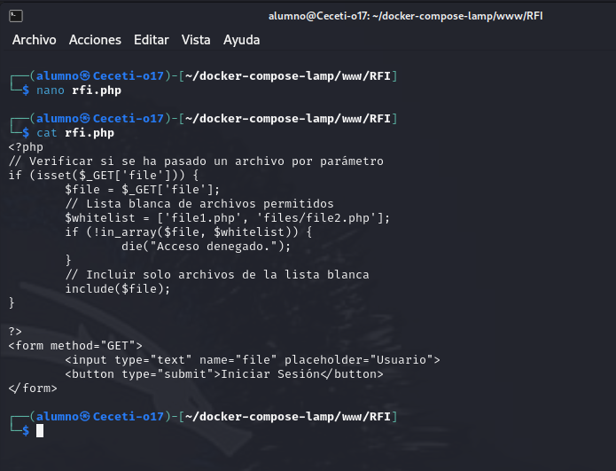

En esta ocasión nos dejaría el acceso a los ficheros file1.php y a /files/file2.php

**Usar rutas absolutas y sanitización**

Podemos ir un paso más allá asegurándonos que solo se incluyan archivos desde una ubicación específica, en este caso el mismo directorio que el script:

~~~
<?php
// Establecemos el directorio permitido en el mismo directorio del script
$baseDir = __DIR__ . DIRECTORY_SEPARATOR;

if (isset($_GET['file'])) {
    $file = $_GET['file'];

    // Normalizamos la ruta para evitar ataques con '../'
    $filePath = realpath($baseDir . $file);
    // Verificamos si el archivo está dentro del directorio permitido
    if ($filePath === false || strpos($filePath, $baseDir) !== 0) {
        die("Acceso denegado.");
    }

    // Verificamos que el archivo realmente existe
    if (!file_exists($filePath)) {
        die("El archivo no existe.");
    }
    include($file);

}
?>
<form method="GET">
        <input type="text" name="file" placeholder="Usuario">
        <button type="submit">Iniciar Sesión</button>
</form>

~~~

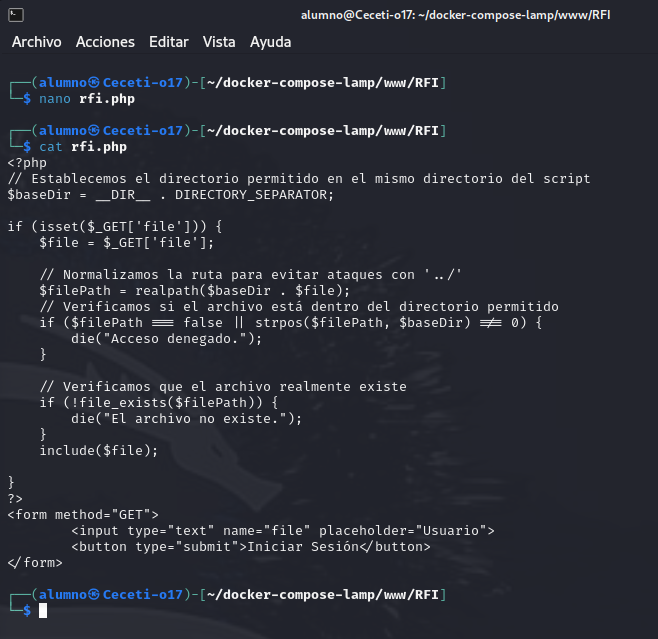

En esta ocasión, solo nos permitirá incluir archivos de nuestro directorio local

**Deshabilitar allow_url_include en php.ini**

Para prevenir la inclusión remota de archivos en PHP, podemos configurar el servidor para que acepte únicamente archivos locales y no archivos remotos.

Esto, como hemos visto anteriormente se hace configurando la variable allow_url_include en el archivo php.ini. Esta opción previene ataques RFI globalmente.
 
~~~ 
allow_url_include = Off
~~~

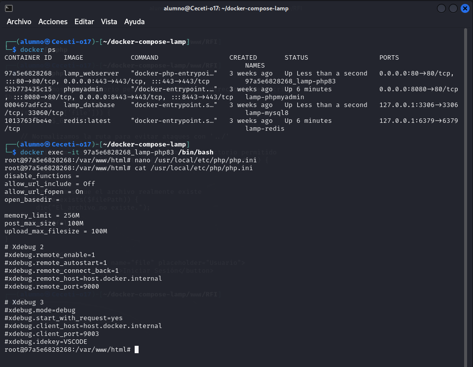

### **Código seguro**
---

Aquí está el código securizado:

~~~
?php
// Establecemos el directorio permitido en el mismo directorio del script
$baseDir = __DIR__ . DIRECTORY_SEPARATOR;
$whitelist = ['file1.php', 'file2.php'];

if (isset($_GET['file'])) {
        $file = $_GET['file'];
        // Bloquear URLs externas
        if (filter_var($file, FILTER_VALIDATE_URL)) {
                die("Incluir archivos remotos está prohibido.");
        }
        // Normalizamos la ruta para evitar ataques con '../'
        $filePath = realpath($baseDir . $file);
        // Verificamos si el archivo está dentro del directorio permitido
        if ($filePath === false || strpos($filePath, $baseDir) !== 0) {
            die("Acceso denegado.");
        }
       // Lista blanca de archivos permitidos
        if (!in_array($file, $whitelist)) {
                die("Acceso denegado.");
        }
 
        // Verificamos que el archivo realmente existe
        if (!file_exists($filePath)) {
            die("El archivo no existe.");
        }
        include($file);

}
?>
<form method="GET">
        <input type="text" name="file" placeholder="Usuario">
        <button type="submit">Iniciar Sesión</button>
</form>

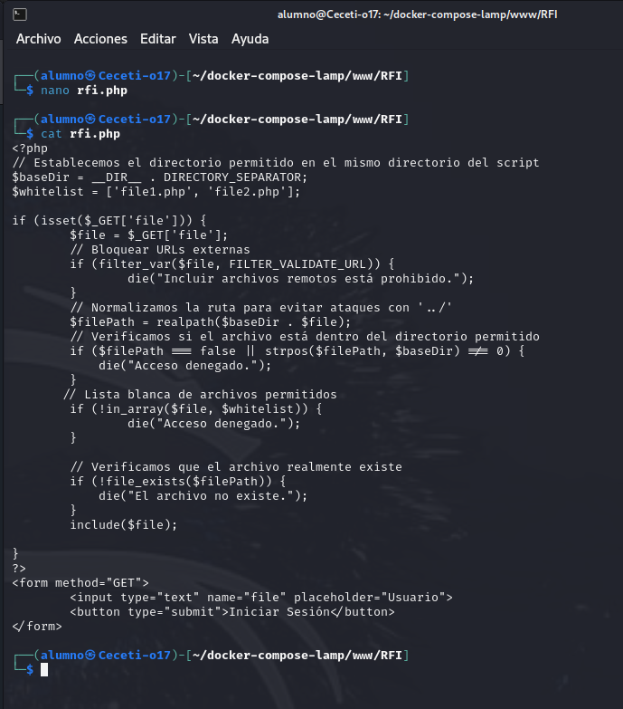

~~~
🔒 Medidas de seguridad implementadas

- Bloqueadas URLs externas.
- Sanitización de ruta (eliminar ../ y evitar que el archivo no tenga caracteres maliciosos).
- Uso de lista blanca de archivos.

### Dejando todo en orden
----

Recuerda volver a poner el archivo php.ini original:

~~~
cd /usr/local/etc/php/
cp php.ini-original php.ini
~~~

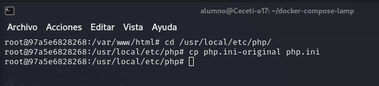

---

> Ángel Pérez Blanco
